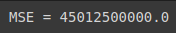
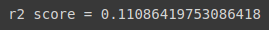
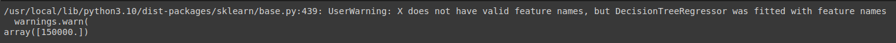

# Implementation-of-Decision-Tree-Regressor-Model-for-Predicting-the-Salary-of-the-Employee

## AIM:
To write a program to implement the Decision Tree Regressor Model for Predicting the Salary of the Employee.

## Equipments Required:
1. Hardware – PCs
2. Anaconda – Python 3.7 Installation / Jupyter notebook

## Algorithm
``` md
1. Import the necessary libraries and read the csv file.
2. Gather information from the datset.
3. Implement Label Encoding.
4. Train the model using Decision Tree Regressor.
5. Calculate the accuracy and r2 score.
6. Predict the outcome with a different data.
```


## Program:
```python
# Program to implement the Decision Tree Regressor Model for Predicting the Salary of the Employee.
# Developed by   : Sam Israel D 
# RegisterNumber : 212222230128
```
#### Data Loading
```python
import pandas as pd
df = pd.read_csv('Salary.csv')
df.head()
```
#### Information retrieval
```python
df.info()
df.isnull().sum()
```
#### Data Preprocessing
```python
from sklearn.preprocessing import LabelEncoder
le = LabelEncoder()
df['Position'] = le.fit_transform(df['Position'])
df.head()
```
#### Feature and Target selection
```python
x = df[['Position','Level']]
x.head()
y = df[['Salary']]
```
#### Train-Test Split
```python
from sklearn.model_selection import train_test_split
X_train, X_test, y_train, y_test = train_test_split(x, y, test_size=0.2, random_state=42)
```
#### Model Training
```python
from sklearn.tree import DecisionTreeRegressor
dt = DecisionTreeRegressor()
dt.fit(X_train,y_train)
y_pred = dt.predict(X_test)
```
#### Model Evaluation
```python
from sklearn.metrics import mean_squared_error, r2_score
mse = mean_squared_error(y_test, y_pred)
print(f'MSE = {mse}')
r2 = r2_score(y_test, y_pred)
print(f'r2 score = {r2}')
```
#### New Prediction
```python
dt.predict([[5,6]])
```


## Output:

#### data.head()
.png)
#### data.info()
.png)
#### isnull() & sum() function 
.png)
#### data.head() for position 
%20after%20position.png)
#### MSE value

#### R2 value 

#### Prediction value


## Result:
Thus the program to implement the Decision Tree Regressor Model for Predicting the Salary of the Employee is written and verified using python programming.